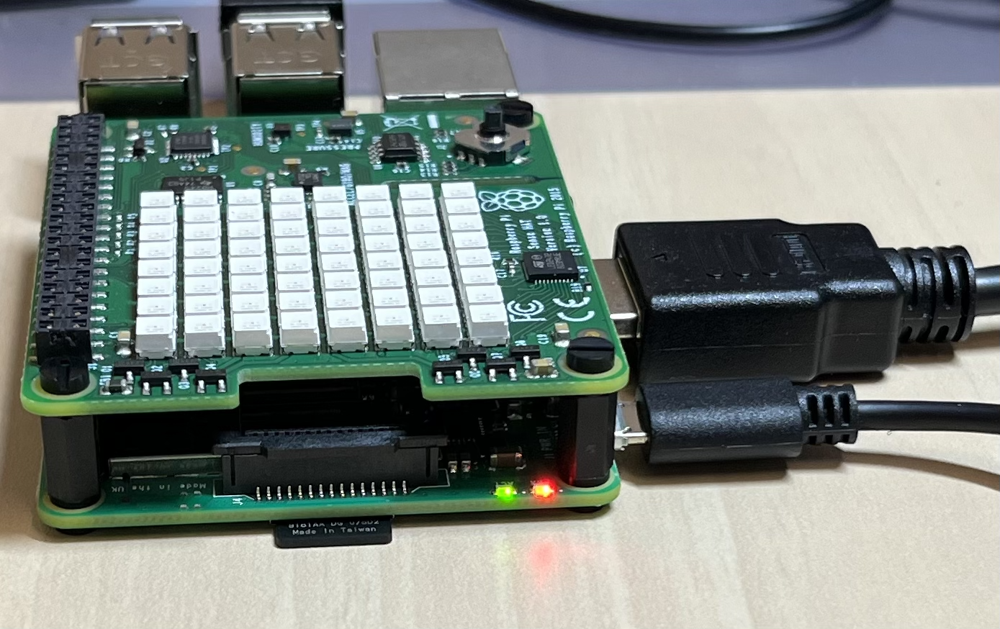

# 終了時の片づけについて

## ラズパイの片づけ
1. まずはラズパイをシャットダウンします．

```
sudo shutdown -h now
```

1. 緑色のランプが光らなくなり，赤色のランプだけ点灯している状態になっていることを確認してください．

以下の写真のように緑色のランプが点滅している場合は少し待ってください．


以下の写真のように赤色のランプだけが光っている状態が10秒以上続いたら次に進んで大丈夫です．


2. スイッチを押します．


3. コンセントからアダプタを抜きます．

4. SDカードを抜いてからCore Memberに渡してください．

5. ラズパイと電源ケーブルを箱にしまってください．

## アンケートに回答する

[こちらのアンケート](https://forms.gle/f5N4Kyiid5H3SbVx7)にお答えください．  
  
**全て終わった方はCore Memberに一言声をかけてください．**